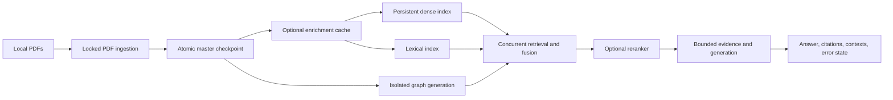

# Architecture

The notebook is an optional interactive adapter. Durable state transitions, PDF extraction, graph synchronization, retrieval, and evaluation live in `src/rag_pipeline`. The core package needs no model downloads, service credentials, or GPU.

## State and failure boundaries

- `ingestion.py` locks the master checkpoint while reading and replacing it. `processing.py` stages corpus changes in memory and persists them before publishing to the caller. A parse failure preserves the previous corpus; a successfully empty PDF removes its previous chunks. `None` means an unchanged PDF, while `[]` means successfully processed with no retained text.
- Pages are split into bounded, overlapping text chunks with deterministic page/local IDs. Changing extraction settings changes the stored pipeline signature, forcing reprocessing. Configured PDF byte/page limits constrain inputs, but parsing is not a sandbox.
- `storage.py` writes unique same-directory temporary files, fsyncs file contents, atomically replaces the destination, and fsyncs the directory on POSIX. Failures propagate. Missing checkpoints start empty; corrupt, oversized, or malformed checkpoints fail visibly.
- `manifest.py` validates store names and schemas and uses portable cross-process file locks. Manifest read/modify/write is serialized. A corrupt manifest is never silently replaced.
- `enrichment.py` reuses only cache entries matching the current hash, extraction signature, and source text. API failures remain uncached and retryable. Raw chunks remain immutable during enrichment. Notebook enrichment writes are locked; cache selection can run offline.
- `chroma_pipeline.py` fingerprints each document's hash, extraction version, enriched text, metadata, and embedding signature. It upserts replacements before pruning stale IDs, then checkpoints the document. Deleted PDFs are handled even if no ingestion is needed. Legacy hash-only manifests trigger one migration reindex.
- Chroma synchronization is idempotent but **not an atomic multi-record transaction**. A backend failure can leave partial replacement records; the unchanged manifest ensures retry. Run one writer per store and pause queries during ingestion if readers require a consistent corpus. Notebook ingestion takes a store lock; custom callers must do the same.
- Cleanup scans finish before deletion. IDs are spooled to a temporary file, preventing offset-pagination skips with bounded scan buffers. Disk use scales with stale IDs. Concurrent external writes during a scan are unsupported.
- `lightrag_pipeline.py` rebuilds into a new generation when corpus content/configuration changes. It validates document completion and flushes stores before atomically publishing `current.json`. Changed and removed PDFs therefore cannot retain relationships in the active graph. A failed build preserves the active pointer. Each generation needs a distinct adapter workspace; the notebook uses its generation name.
- Older graph generations are retained for recovery. This intentionally trades extra storage and rebuild cost for consistency with graph APIs that cannot safely reverse extracted relationships. Stop/finalize old readers before manually deleting old generations.

## Query boundary

`query_answer()` returns a structured `QueryResult` with aligned source IDs, PDF names, pages, bounded evidence, and an explicit failure state. `generate_trading_answer_robust()` preserves the previous `(answer, contexts)` interface.

Graph, dense, and BM25 retrieval run concurrently and fail independently. Synchronous storage/model/client operations run in worker threads; native async adapters are awaited. Fusion deduplicates IDs, ranking handles ties deterministically, and non-finite scores are rejected. A reranker failure falls back to fused order. Generation is skipped when there is no evidence. Reranking and generation have bounded inputs.

Query timeouts bound caller waits. Cancellation cannot kill an already running synchronous worker; configure network timeouts in injected clients as the notebook does with `GROQ_TIMEOUT`. Injected adapters must be safe for worker-thread use. Use LightRAG's `aquery`, rather than its event-loop-owning synchronous wrapper.

Retrieved text is JSON-encoded as untrusted evidence under a separate system instruction. This reduces instruction confusion, but does not eliminate LLM prompt injection or prove answer factuality. The pipeline has no tool execution or trading execution capability.

## Deployment scope

This is a local/library/notebook pipeline, not a multi-tenant authenticated service. It does not provide user authorization, tenant isolation, request queues, or an API server. Keep state directories private and do not expose Chroma/Ollama directly to untrusted networks. If adding a service, design those boundaries before accepting arbitrary documents or URLs.

For large/untrusted documents, put parsing/model work in workers with process-level CPU/memory/time limits. The current master checkpoint and lexical index still scale with corpus size in memory; JSON size guards fail rather than pretend data is absent. A transactional database/checkpoint store and sharded lexical index are the next step for corpora exceeding that budget, not an untested distributed rewrite.
